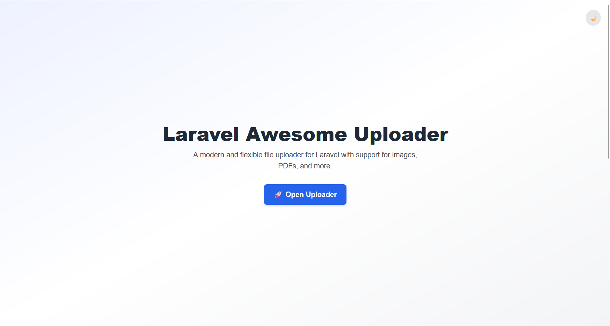

# Laravel Awesome Uploader

A **production-ready**, customizable and pluggable file uploader for Laravel that supports Blade, React, and Vue with enterprise-level features.

## Features

- **🎯 Any File Type**: Upload images, PDFs, documents, and more with comprehensive validation.
- **🖥️ Multiple Frontend Options**: Blade, React, and Vue components out of the box.
- **☁️ Configurable Storage**: Use any of Laravel's filesystem disks (local, S3, etc.).
- **🖼️ Advanced Image Processing**: Automatic image optimization, thumbnail generation, and orientation correction (gracefully handles missing `intervention/image`).
- **📊 JSON Responses**: Consistent API responses with file `path`, `url`, `type`, `name`, `size`, `file_hash`, and (if enabled) `id`.
- **🎨 Drag & Drop**: Modern drag-and-drop UI for all frontend components.
- **💾 Database Integration**: Optionally save uploads to the database with comprehensive querying.
- **🗑️ Soft Deletes**: Optionally enable soft deletes for uploads with automatic cleanup.
- **👥 Smart User/Admin Management**: Advanced user/admin filtering with customizable access control.
- **🔒 Policy-Driven Permissions**: Secure, customizable access control for uploads with guest support.
- **🔍 File Deduplication**: Intelligent duplicate detection using file hashes to prevent redundant uploads.
- **🔧 Comprehensive Error Handling**: Robust error handling with detailed logging and graceful degradation.
- **📈 Performance Optimized**: Database indexing, pagination, and efficient file operations.
- **🛡️ Enhanced Security**: Multi-layer validation, MIME type checking, and filename sanitization.
- **📸 Automatic Thumbnails**: Generate multiple thumbnail sizes for images automatically.
- **🔗 Thumbnail Links**: Copy thumbnail URLs for easy integration in your applications.
- **👤 Guest Upload Support**: Allow non-authenticated users to upload with rate limiting.
- **📊 Upload Statistics**: Built-in analytics for file uploads and storage usage.
- **🧹 File Cleanup**: Automatic detection and cleanup of orphaned files.

## Screenshots




## Installation

Install the package via composer:

```bash
composer require hozien/laravel-awesome-uploader
```

Publish the package's assets:

```bash
php artisan vendor:publish --provider="Hozien\Uploader\UploaderServiceProvider"
```

This publishes:

- Configuration file to `config/uploader.php`
- Views to `resources/views/vendor/uploader`
- Frontend assets to `public/vendor/uploader`
- Migrations to `database/migrations`
- Translation files to `resources/lang/vendor/uploader`

## Prerequisites

### Required Dependencies

**For Image Processing Features:**

```bash
composer require intervention/image
```

**Version Compatibility:**

- **Intervention Image v2.x** (^2.5) - Fully supported
- **Intervention Image v3.x** (^3.0) - Fully supported
- The package automatically detects and adapts to the installed version

**Why this is needed:**

- Image optimization and compression
- Automatic thumbnail generation
- Image orientation correction (EXIF data)
- Image format conversion and manipulation

**What happens without it:**

- Uploader works normally for all file types
- Image processing features are gracefully disabled
- Warning logged: "Intervention Image package not installed - image processing disabled"
- No errors or broken functionality

### System Requirements

- **PHP**: 8.1 or higher
- **Laravel**: 9.0, 10.0, 11.0, or 12.0
- **Storage**: Any Laravel filesystem disk (local, S3, etc.)
- **Database**: MySQL, PostgreSQL, SQLite, or SQL Server (for database integration)

## Database Setup

**Required for database integration:**

1. Publish and run the migration:
   ```bash
   php artisan vendor:publish --tag=uploader-migrations
   php artisan migrate
   ```

This creates the `uploads` table with:

- File metadata (path, url, type, name, size)
- File hash for deduplication
- User/guest tracking
- Soft delete support
- Performance indexes

## Configuration

### Environment Variables

Add these to your `.env` file for easy configuration:

```env
# Storage
UPLOADER_DISK=public
UPLOADER_SAVE_TO_DB=true

# File Validation
UPLOADER_MAX_SIZE=2048
UPLOADER_STRICT_MIME=true

# File Deduplication
UPLOADER_CHECK_DUPLICATES=true
UPLOADER_RETURN_EXISTING=true

# Image Processing
UPLOADER_IMAGE_OPTIMIZATION=true
UPLOADER_IMAGE_QUALITY=85
UPLOADER_AUTO_ORIENT=true

# Thumbnail Generation
UPLOADER_GENERATE_THUMBNAILS=true
UPLOADER_THUMBNAIL_QUALITY=80

# Guest Uploads
UPLOADER_ALLOW_GUESTS=true
UPLOADER_GUEST_LIMIT=10

# Performance
UPLOADER_PAGINATION_LIMIT=20

# Security & Cleanup
UPLOADER_SOFT_DELETES=true
UPLOADER_AUTO_CLEANUP=false
UPLOADER_CLEANUP_DAYS=30

# Logging
UPLOADER_ENABLE_LOGGING=false
UPLOADER_LOG_CHANNEL=daily
```

### Advanced Configuration

Customize behavior in `config/uploader.php`:

```php
return [
    // Storage configuration
    'disk' => env('UPLOADER_DISK', 'public'),
    'save_to_db' => env('UPLOADER_SAVE_TO_DB', false),

    // File validation
    'allowed_file_types' => [
        'jpg', 'jpeg', 'png', 'gif', 'webp',
        'pdf', 'doc', 'docx', 'xls', 'xlsx', 'ppt', 'pptx',
        'txt', 'csv', 'zip', 'rar'
    ],
    'max_size' => env('UPLOADER_MAX_SIZE', 2048), // KB
    'strict_mime_validation' => env('UPLOADER_STRICT_MIME', true),

    // File deduplication
    'check_duplicates' => env('UPLOADER_CHECK_DUPLICATES', true),
    'return_existing_on_duplicate' => env('UPLOADER_RETURN_EXISTING', true),

    // Image processing (requires intervention/image)
    'image_optimization' => env('UPLOADER_IMAGE_OPTIMIZATION', true),
    'image_quality' => env('UPLOADER_IMAGE_QUALITY', 85),
    'auto_orient' => env('UPLOADER_AUTO_ORIENT', true),

    // Thumbnail generation
    'generate_thumbnails' => env('UPLOADER_GENERATE_THUMBNAILS', true),
    'thumbnail_sizes' => [150, 300, 600], // pixels
    'thumbnail_quality' => env('UPLOADER_THUMBNAIL_QUALITY', 80),

    // Guest uploads
    'allow_guests' => env('UPLOADER_ALLOW_GUESTS', true),
    'guest_upload_limit' => env('UPLOADER_GUEST_LIMIT', 10),
    'guest_token_resolver' => function () {
        return session()->getId();
    },

    // Smart user/admin logic
    'user_resolver' => function () { return auth()->user(); },
    'admin_resolver' => function ($user) {
        return $user && property_exists($user, 'is_admin') && $user->is_admin;
    },
    'uploads_query' => function ($query, $user, $isAdmin) {
        if ($isAdmin) return $query;
        return $query->where('user_id', $user ? $user->id : null);
    },
];
```

### Image Processing Configuration

**⚠️ Important:** Image processing features require the `intervention/image` package. Install it first:

```bash
composer require intervention/image
```

#### Image Optimization Settings

```env
# Enable/disable image optimization (default: true)
UPLOADER_IMAGE_OPTIMIZATION=true

# Image quality for optimization (1-100, default: 85)
UPLOADER_IMAGE_QUALITY=85

# Auto-correct image orientation from EXIF data (default: true)
UPLOADER_AUTO_ORIENT=true
```

**What these do:**

- **`UPLOADER_IMAGE_OPTIMIZATION`**: Enables compression and optimization of uploaded images
- **`UPLOADER_IMAGE_QUALITY`**: Controls compression level (higher = better quality, larger file)
- **`UPLOADER_AUTO_ORIENT`**: Fixes images that appear rotated due to EXIF orientation data

#### Thumbnail Generation Settings

```env
# Enable/disable automatic thumbnail generation (default: true)
UPLOADER_GENERATE_THUMBNAILS=true

# Quality for thumbnail images (1-100, default: 80)
UPLOADER_THUMBNAIL_QUALITY=80
```

**Thumbnail Sizes** (configured in `config/uploader.php`):

```php
'thumbnail_sizes' => [150, 300, 600], // Width in pixels
```

**Generated Files:**

- Original: `uploads/image.jpg`
- Thumbnails:
  - `uploads/image_thumb_150.jpg` (150px wide)
  - `uploads/image_thumb_300.jpg` (300px wide)
  - `uploads/image_thumb_600.jpg` (600px wide)

#### Testing Image Processing

**1. Verify Installation:**

```bash
# Check if intervention/image is installed
composer show intervention/image
```

**2. Test Upload Response:**
Upload an image and check the response for:

```json
{
  "success": true,
  "path": "uploads/image.jpg",
  "thumbnails": {
    "150": {
      "path": "uploads/image_thumb_150.jpg",
      "url": "http://your-app.com/storage/uploads/image_thumb_150.jpg",
      "size": 12345
    },
    "300": { ... },
    "600": { ... }
  }
}
```

**3. Check File Sizes:**

- Original image should be compressed (smaller file size)
- Thumbnails should be significantly smaller
- All images should have correct orientation

#### Troubleshooting Image Processing

**Problem: No thumbnails generated**

- **Solution**: Install `intervention/image` package
- **Check**: Look for warning in Laravel logs: "Intervention Image package not installed"

**Problem: Images still large after optimization**

- **Solution**: Lower `UPLOADER_IMAGE_QUALITY` value (try 70-80)
- **Check**: Original image format (PNG files compress less than JPEG)

**Problem: Thumbnails not appearing**

- **Solution**: Check storage disk configuration and file permissions
- **Check**: Verify thumbnail paths in response

**Problem: Images appear rotated**

- **Solution**: Ensure `UPLOADER_AUTO_ORIENT=true`
- **Check**: Image has EXIF orientation data

#### Performance Considerations

- **Quality vs Size**: Lower quality = smaller files = faster uploads
- **Thumbnail Count**: More sizes = more processing time
- **Storage Space**: Each thumbnail uses additional storage
- **Processing Time**: Large images take longer to process

**Recommended Settings for Production:**

```env
UPLOADER_IMAGE_QUALITY=80          # Good balance of quality/size
UPLOADER_THUMBNAIL_QUALITY=75      # Thumbnails can be lower quality
UPLOADER_GENERATE_THUMBNAILS=true  # Enable for responsive design
```

### Logging Configuration

The uploader provides comprehensive logging for both backend and frontend operations. You can control logging behavior through environment variables:

#### Backend Logging

Backend logging is controlled by Laravel's logging system and the uploader's configuration:

```env
# Enable/disable uploader-specific logging (default: false)
UPLOADER_ENABLE_LOGGING=false

# Laravel log channel for uploader logs (default: daily)
UPLOADER_LOG_CHANNEL=daily
```

**Backend Logging Features:**

- Upload attempts and results
- File validation errors
- Duplicate detection
- Image processing operations
- Guest token management
- Permission checks
- Error tracking and debugging

#### Frontend Logging

Frontend console logging is also controlled by the `UPLOADER_ENABLE_LOGGING` setting:

**When `UPLOADER_ENABLE_LOGGING=true`:**

- API request/response logging
- File upload progress
- Error details and debugging
- Guest token operations
- Permission checks
- File manager operations

**When `UPLOADER_ENABLE_LOGGING=false` (default):**

- Silent operation
- No console output
- Clean production environment

#### Logging Best Practices

```env
# Development environment - enable detailed logging
UPLOADER_ENABLE_LOGGING=true
UPLOADER_LOG_CHANNEL=daily

# Production environment - disable logging for performance
UPLOADER_ENABLE_LOGGING=false
UPLOADER_LOG_CHANNEL=daily
```

**Example Log Output:**

```
[2025-07-26 22:42:20] uploader.INFO: File uploaded successfully {"file":"example.jpg","size":26020,"user_id":null,"guest_token":"guest-abc123"}
[2025-07-26 22:42:21] uploader.INFO: Thumbnails generated for example.jpg {"thumbnails":["150x150","300x300","600x600"]}
[2025-07-26 22:42:22] uploader.WARNING: Duplicate file detected {"existing_file":"example.jpg","new_file":"example.jpg","hash":"abc123"}
```

## Usage

### Blade Components

**Basic Usage:**

```blade
<!-- Add a button to open the uploader -->
<button onclick="window.dispatchEvent(new Event('open-uploader'))">
    Open Uploader
</button>

<!-- Include the uploader component -->
<x-uploader::popup
    :saveToDb="true"
    :multiple="true"
/>
```

<!-- Include the uploader JS asset (required) -->
<script src="{{ asset('vendor/uploader/popup.js') }}"></script>

<!-- Listen for upload events -->
<script>
    window.addEventListener("upload-success", (event) => {
        console.log("Upload successful:", event.detail);
        // Handle successful upload
        const response = event.detail.response;
        if (response.is_duplicate) {
            console.log("File was a duplicate, using existing file");
        }
        if (response.thumbnails) {
            console.log("Thumbnails generated:", response.thumbnails);
        }
    });

    window.addEventListener("upload-error", (event) => {
        console.error("Upload failed:", event.detail);
        // Handle upload errors
    });
</script>

````

**Component Options:**

- `:saveToDb="true"` — Save uploads to database (default: config value)
- `:multiple="true"` — Allow multiple file uploads (default: true)
- All labels and options are customizable via props or translation files

### React Component

```jsx
import React from "react";
import Uploader from "../vendor/uploader/react/Uploader";

function MyComponent() {
  const handleUploadSuccess = (response) => {
    console.log("Upload successful:", response);

    // Check for duplicates
    if (response.is_duplicate) {
      alert("File already exists, using existing copy");
    }

    // Handle thumbnails
    if (response.thumbnails) {
      console.log("Generated thumbnails:", response.thumbnails);
    }
  };

  const handleUploadError = (error) => {
    console.error("Upload failed:", error);

    // Handle specific errors
    if (error.errors) {
      error.errors.forEach((err) => console.error(err));
    }
  };

  return (
    <div>
      <h1>My React App</h1>
      <Uploader
        onUploadSuccess={handleUploadSuccess}
        onUploadError={handleUploadError}
        multiple={true}
        saveToDb={true}
      />
    </div>
  );
}

export default MyComponent;
````

### Vue Component

```vue
<template>
  <div>
    <h1>My Vue App</h1>
    <Uploader
      @upload-success="onUploadSuccess"
      @upload-error="onUploadError"
      :multiple="true"
      :save-to-db="true"
    />
  </div>
</template>

<script>
import Uploader from "../vendor/uploader/vue/Uploader.vue";

export default {
  components: {
    Uploader,
  },
  methods: {
    onUploadSuccess(response) {
      console.log("Upload successful:", response);

      // Handle duplicates
      if (response.is_duplicate) {
        this.$toast.info("File already exists, using existing copy");
      }

      // Handle thumbnails
      if (response.thumbnails) {
        this.handleThumbnails(response.thumbnails);
      }
    },
    onUploadError(error) {
      console.error("Upload failed:", error);
      this.$toast.error("Upload failed: " + error.message);
    },
    handleThumbnails(thumbnails) {
      // Process generated thumbnails
      Object.entries(thumbnails).forEach(([size, thumbnail]) => {
        console.log(`${size}px thumbnail:`, thumbnail.url);
      });
    },
  },
};
</script>
```

## API Endpoints

The package provides several API endpoints for file management:

### Upload Files

**Single File Upload:**

```bash
POST /api/uploader/upload
Content-Type: multipart/form-data

file: [file]
saveToDb: true|false
guest_token: [optional for guests]
```

**Multiple File Upload:**

```bash
POST /api/uploader/upload
Content-Type: multipart/form-data

files[]: [file1, file2, ...]
multiple: true
saveToDb: true|false
guest_token: [optional for guests]
```

**Response Format:**

```json
{
  "success": true,
  "path": "uploads/filename.jpg",
  "url": "/storage/uploads/filename.jpg",
  "type": "image/jpeg",
  "name": "original-filename.jpg",
  "size": 12345,
  "file_hash": "md5hash",
  "is_duplicate": false,
  "id": 123,
  "thumbnails": {
    "150": {
      "path": "uploads/filename_thumb_150.jpg",
      "url": "/storage/uploads/filename_thumb_150.jpg",
      "size": 3456
    }
  }
}
```

### Fetch Uploads

```bash
GET /api/uploader/uploads?page=1&per_page=20&type=images&search=filename
```

**Query Parameters:**

- `page` - Page number for pagination
- `per_page` - Items per page (max 100)
- `type` - Filter by type: `images`, `documents`, or specific MIME type
- `search` - Search by filename
- `sort_by` - Sort field (default: `created_at`)
- `sort_order` - Sort direction: `asc` or `desc`
- `guest_token` - Required for guest uploads

**Response:**

```json
{
  "data": [
    {
      "id": 123,
      "name": "filename.jpg",
      "path": "uploads/filename.jpg",
      "url": "/storage/uploads/filename.jpg",
      "type": "image/jpeg",
      "size": 12345,
      "file_hash": "md5hash",
      "formatted_size": "12.1 KB",
      "is_image": true,
      "user_id": 1,
      "guest_token": null,
      "created_at": "2024-01-01T00:00:00.000000Z",
      "permissions": {
        "view": true,
        "delete": true,
        "download": true
      }
    }
  ],
  "current_page": 1,
  "per_page": 20,
  "total": 100
}
```

### Delete Upload

```bash
DELETE /api/uploader/uploads/{id}
```

### Upload Statistics (Authenticated Users)

```bash
GET /api/uploader/stats
```

**Response:**

```json
{
  "total_files": 50,
  "total_size": 1048576,
  "total_size_formatted": "1 MB",
  "image_count": 30,
  "document_count": 20
}
```

### Cleanup Orphaned Files (Admin Only)

```bash
POST /api/uploader/cleanup
```

**Response:**

```json
{
  "cleaned": 5,
  "files": ["uploads/orphaned1.jpg", "uploads/orphaned2.pdf"]
}
```

## Advanced Features

### File Deduplication

The package automatically detects duplicate files using MD5 hashing:

```php
// In your controller or service
$uploader = app('uploader');

// Check for duplicates before upload
$duplicate = $uploader->findDuplicate($uploadedFile);
if ($duplicate) {
    // Handle duplicate - return existing file or allow new upload
}
```

### Thumbnail Management

Automatic thumbnail generation for images:

```php
// Generate thumbnails manually
$imageProcessor = new ImageProcessor();
$thumbnails = $imageProcessor->generateThumbnails($imagePath, [
    'sizes' => [150, 300, 600],
    'thumbnail_quality' => 80
]);

// Delete thumbnails when removing files
$imageProcessor->deleteThumbnails($imagePath);
```

### Upload Statistics

Get comprehensive upload statistics:

```php
$uploader = app('uploader');

// Get stats for current user
$userStats = $uploader->getUploadStats(auth()->id());

// Get stats for all users (admin)
$allStats = $uploader->getUploadStats();
```

### File Cleanup

Clean up orphaned files:

```php
$uploader = app('uploader');
$result = $uploader->cleanupOrphanedFiles();

echo "Cleaned {$result['cleaned']} orphaned files";
```

## Security Features

### File Validation

Multi-layer validation includes:

- File extension checking
- MIME type validation
- File size limits
- Content-based validation
- Filename sanitization

### Guest Upload Security

- Rate limiting per session
- Configurable upload limits
- Session-based tracking
- Optional guest token validation

### Permission System

Comprehensive policy-based permissions:

```php
// Customize permissions in UploadPolicy
public function delete(User $user, Upload $upload)
{
    // Custom logic for delete permissions
    return $user->hasRole('admin') ||
           ($user->id === $upload->user_id && $user->can('delete-own-uploads'));
}
```

## Testing

The package includes comprehensive tests:

```bash
# Run all tests
php artisan test

# Run specific test suites
php artisan test tests/Feature/UploaderTest.php
php artisan test tests/Unit/ImageProcessorTest.php
```

**Test Coverage:**

- File upload functionality
- Validation and error handling
- Deduplication system
- Image processing
- Permission system
- API endpoints
- Guest uploads

## Guest Uploads

Allow non-authenticated users to upload files:

```php
// Configuration
'allow_guests' => true,
'guest_upload_limit' => 10,
'guest_token_resolver' => function () {
    return session()->getId();
},
```

**Frontend Usage:**

```javascript
// Include guest token in upload requests
const guestToken = "unique-session-id";

fetch("/api/uploader/upload", {
  method: "POST",
  body: formData.append("guest_token", guestToken),
});
```

## JavaScript Events

Enhanced event system for frontend integration:

| Event Name            | Description                   | Payload                            |
| --------------------- | ----------------------------- | ---------------------------------- |
| `files-selected`      | Files selected for upload     | `{ files: FileList }`              |
| `upload-start`        | Upload process begins         | `{ files: FileList }`              |
| `upload-success`      | Upload completed successfully | `{ response: Object }`             |
| `upload-error`        | Upload failed                 | `{ error: Object }`                |
| `upload-progress`     | Upload progress update        | `{ progress: Number }`             |
| `duplicate-detected`  | Duplicate file detected       | `{ file: File, existing: Object }` |
| `thumbnail-generated` | Thumbnail generation complete | `{ thumbnails: Object }`           |

## Performance Considerations

### Database Optimization

The package includes several performance optimizations:

- Strategic database indexes
- Efficient pagination
- Eager loading for relationships
- Query optimization for large datasets

### File Handling

- Unique filename generation prevents conflicts
- Efficient duplicate detection using hashes
- Optimized thumbnail generation
- Background processing support (configurable)

## Troubleshooting

### Common Issues

**Image Processing Not Working:**

- Install `intervention/image` package: `composer require intervention/image`
- The package gracefully degrades without it

**Upload Fails:**

- Check file size limits in both PHP and package config
- Verify disk permissions and configuration
- Check logs for detailed error messages

**Thumbnails Not Generated:**

- Ensure `intervention/image` is installed
- Check image processing configuration
- Verify write permissions to storage directory

### Logging

Enable detailed logging for debugging:

```env
UPLOADER_ENABLE_LOGGING=true
UPLOADER_LOG_CHANNEL=daily
```

View logs:

```bash
tail -f storage/logs/laravel.log
```

## Migration from Previous Versions

### Breaking Changes

1. **API Routes**: Changed from `/api/` to `/api/uploader/`
2. **Response Format**: Enhanced with new fields (`file_hash`, `is_duplicate`, etc.)
3. **Database**: New `file_hash` column required

### Migration Steps

1. **Update Routes**: Change API endpoint URLs in frontend code
2. **Run Migration**: Execute the new migration for database changes
3. **Update Configuration**: Add new environment variables
4. **Test Integration**: Verify all functionality works with new features

## License

The MIT License (MIT). Please see [License File](LICENSE.md) for more information.

## Contributing

Please see [CONTRIBUTING.md](CONTRIBUTING.md) for details.

## Support

- **Documentation**: Full documentation and examples
- **Issues**: GitHub Issues for bug reports
- **Discussions**: GitHub Discussions for questions and ideas

---

**Laravel Awesome Uploader** - Production-ready file uploading with enterprise-level features.
